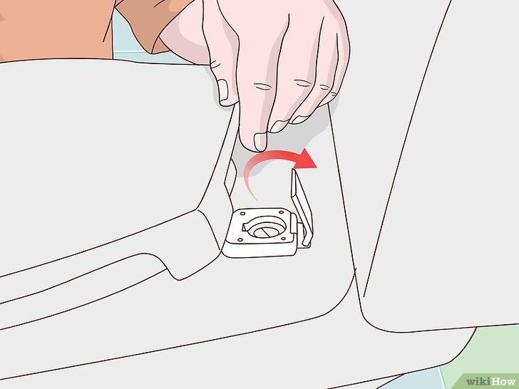

+++
title = "Comment reparer un siège de toilette desserré - P1"
date = 2021-03-01
template = "index.html"
draft = false
categories = [{ name = "Partie 1", url = "partie1.html" },
{ name = "Partie 2", url = "partie2.html" },
{ name = "Partie 3", url = "partie3.html" },
{ name = "Partie 4", url = "partie4.html" },
{ name = "Partie 5", url = "partie5.html" },
{ name = "Partie 6", url = "partie6.html" },
{ name = "Partie 7", url = "partie7.html" },
{ name = "Partie 8", url = "partie8.html" },]
dates = [{creation = 2022-04-27T07:32:00-08:00, lastEdit = 2022-04-28T07:32:00-08:00}]
+++

# 1 Recherchez les vis et ouvrez le couvercle.

En général, l'arrière du siège est relié aux toilettes par deux longues vis 
qui traversent la porcelaine à l'arrière de la cuvette. Elles sont fixées par 
le bas par deux écrous. Cherchez une petite fente à l'avant du couvercle. Elle 
est conçue pour vous aider à le soulever. Ensuite, utilisez un petit tournevis 
pour soulever le couvercle et le siège.

- Les toilettes bon marché ont des vis en plastique. Néanmoins, la plupart des 
toilettes ont des vis en acier, mais les modèles les plus chers en ont en laiton 
ou en acier inoxydable. Faites très attention avec les vis en plastique !

## [Partie 2](./partie2.html)

