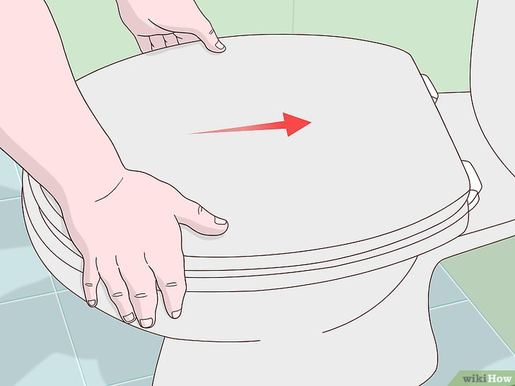

+++
title = "Comment reparer un siège de toilette desserré - P2"
date = 2021-03-01
template = "index.html"
draft = false
categories = [{ name = "Partie 1", url = "partie1.html" },
{ name = "Partie 2", url = "partie2.html" },
{ name = "Partie 3", url = "partie3.html" },
{ name = "Partie 4", url = "partie4.html" },
{ name = "Partie 5", url = "partie5.html" },
{ name = "Partie 6", url = "partie6.html" },
{ name = "Partie 7", url = "partie7.html" },
{ name = "Partie 8", url = "partie8.html" },]
dates = [{creation = 2022-04-27T07:32:00-08:00, lastEdit = 2022-04-28T07:32:00-08:00}]
+++

# 2 Centrez le siège sur les toilettes.

S'il est desserré, il peut bouger dans tous les sens 
et ne sera pas aligné avec le bord de la cuvette. Ajustez
le siège pour qu'il reste immobile juste au-dessus de la 
cuvette. Ce serait bien de vous assoir dessus pour voir si
vous vous sentiez à l'aise.

## [Partie 3](./partie3.html)