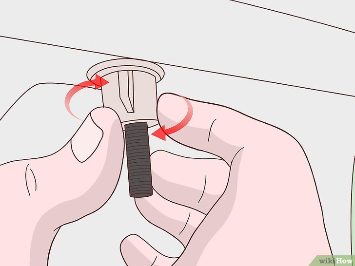

+++
title = "Comment reparer un siège de toilette desserré - P3"
date = 2021-03-01
template = "index.html"
draft = false
categories = [{ name = "Partie 1", url = "partie1.html" },
{ name = "Partie 2", url = "partie2.html" },
{ name = "Partie 3", url = "partie3.html" },
{ name = "Partie 4", url = "partie4.html" },
{ name = "Partie 5", url = "partie5.html" },
{ name = "Partie 6", url = "partie6.html" },
{ name = "Partie 7", url = "partie7.html" },
{ name = "Partie 8", url = "partie8.html" },]
dates = [{creation = 2022-04-27T07:32:00-08:00, lastEdit = 2022-04-28T07:32:00-08:00}]
+++

# 1 Recherchez les vis et ouvrez le couvercle.

Pour ce faire, tournez le tournevis dans le sens horaire. N'oubliez pas que si 
vous tournez à droite, elle sera serrée et à gauche, elle se desserrera. Généralement,
verrez un écrou à ailettes qui l'empêchera de tourner. S'il y en a, tenez l'écrou avec 
un chiffon pendant que vous serrez la vis.

- Choisissez le tournevis approprié. Assurez-vous que la pointe du tournevis est 
- suffisamment large pour s'insérer dans l'encoche de la tête de la vis. Si le tournevis 
- est trop petit, la vis ne tournera pas. Les frottements générés lors du glissement de 
- l'outil useront très vite la vis et la rendront inutilisable.

## [Partie 4](./partie4.html)
