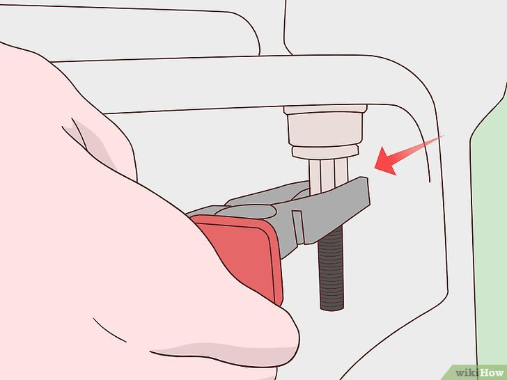

+++
title = "Comment reparer un siège de toilette desserré - P4"
date = 2021-03-01
template = "index.html"
draft = false
categories = [{ name = "Partie 1", url = "partie1.html" },
{ name = "Partie 2", url = "partie2.html" },
{ name = "Partie 3", url = "partie3.html" },
{ name = "Partie 4", url = "partie4.html" },
{ name = "Partie 5", url = "partie5.html" },
{ name = "Partie 6", url = "partie6.html" },
{ name = "Partie 7", url = "partie7.html" },
{ name = "Partie 8", url = "partie8.html" },]
dates = [{creation = 2022-04-27T07:32:00-08:00, lastEdit = 2022-04-28T07:32:00-08:00}]
+++

# 4 Exercez une pression.

Si la vis continue de tourner sans se serrer, maintenez l'écrou inférieur avec une 
pince. Tenez fermement une extrémité de l'écrou au fur et à mesure que vous vissez 
le boulon. Une fois que vous avez tourné la vis plusieurs fois, l'ailette qui se 
trouve sur l'écrou doit l'empêcher de tourner.

- Pour desserrer l'écrou, appliquez-y de l'huile pénétrante WD-40 
et attendez pendant cinq minutes.

## [Partie 5](./partie5.html)
