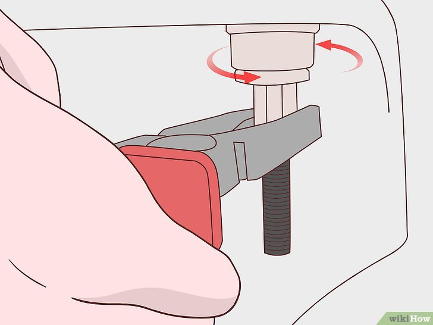

+++
title = "Comment reparer un siège de toilette desserré - P5"
date = 2021-03-01
template = "index.html"
draft = false
categories = [{ name = "Partie 1", url = "partie1.html" },
{ name = "Partie 2", url = "partie2.html" },
{ name = "Partie 3", url = "partie3.html" },
{ name = "Partie 4", url = "partie4.html" },
{ name = "Partie 5", url = "partie5.html" },
{ name = "Partie 6", url = "partie6.html" },
{ name = "Partie 7", url = "partie7.html" },
{ name = "Partie 8", url = "partie8.html" },]
dates = [{creation = 2022-04-27T07:32:00-08:00, lastEdit = 2022-04-28T07:32:00-08:00}]
+++

# 5 Continuez à visser jusqu'à ce que le siège soit serré.

Lorsque la vis est serrée, vous pouvez la tourner à nouveau 
dans un quart de tour pour qu'elle soit bien fixée. Une fois 
que le siège cesse de bouger, refermez le couvercle. Il devrait 
se fermer sans problèmes.

## [Partie 6](./partie6.html)
