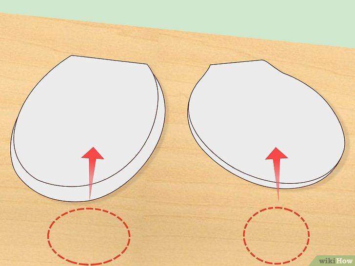

+++
title = "Comment reparer un siège de toilette desserré - P7"
date = 2021-03-01
template = "index.html"
draft = false
categories = [{ name = "Partie 1", url = "partie1.html" },
{ name = "Partie 2", url = "partie2.html" },
{ name = "Partie 3", url = "partie3.html" },
{ name = "Partie 4", url = "partie4.html" },
{ name = "Partie 5", url = "partie5.html" },
{ name = "Partie 6", url = "partie6.html" },
{ name = "Partie 7", url = "partie7.html" },
{ name = "Partie 8", url = "partie8.html" },]
dates = [{creation = 2022-04-27T07:32:00-08:00, lastEdit = 2022-04-28T07:32:00-08:00}]
+++

# 7 Déterminez le type de siège dont vous avez besoin.

Il existe deux styles courants de sièges de toilette : rond et 
allongé. Les sièges ronds sont bien circulaires, tandis que les 
modèles allongés sont oblongs et en forme d'œuf. Procurez-vous le 
siège qui correspond à la cuvette de vos toilettes.

- Essayez de trouver un siège de la même marque que vos toilettes. Les sièges génériques peuvent bien faire l'affaire, mais ils ne peuvent pas bien s'ajuster.
- N'oubliez pas que les sièges en plastique sont plus faciles à désinfecter que ceux en bois. De plus, ils conservent plus longtemps leur couleur.

## [Partie 8](./partie8.html)
