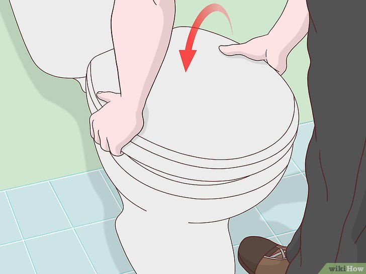

+++
title = "Comment reparer un siège de toilette desserré - P8"
date = 2021-03-01
template = "index.html"
draft = false
categories = [{ name = "Partie 1", url = "partie1.html" },
{ name = "Partie 2", url = "partie2.html" },
{ name = "Partie 3", url = "partie3.html" },
{ name = "Partie 4", url = "partie4.html" },
{ name = "Partie 5", url = "partie5.html" },
{ name = "Partie 6", url = "partie6.html" },
{ name = "Partie 7", url = "partie7.html" },
{ name = "Partie 8", url = "partie8.html" },]
dates = [{creation = 2022-04-27T07:32:00-08:00, lastEdit = 2022-04-28T07:32:00-08:00}]
+++

# 8 [Installez un nouveau siège](https://fr.wikihow.com/installer-un-nouveau-si%C3%A8ge-de-toilette).

Si les vis sont endommagées ou si le siège est toujours lâche
après que vous avez essayé de le serrer, vous devez peut-être 
donc remplacer uniquement les pièces individuelles et laisser 
le siège intact. Toutefois, si la structure du siège est en
mauvais état, vous devrez peut-être le changer pour qu'il dure
plus longtemps. Cherchez des sièges de toilette dans une 
quincaillerie locale ou dans un magasin où se vendent des objets
pour la maison et le jardin.
