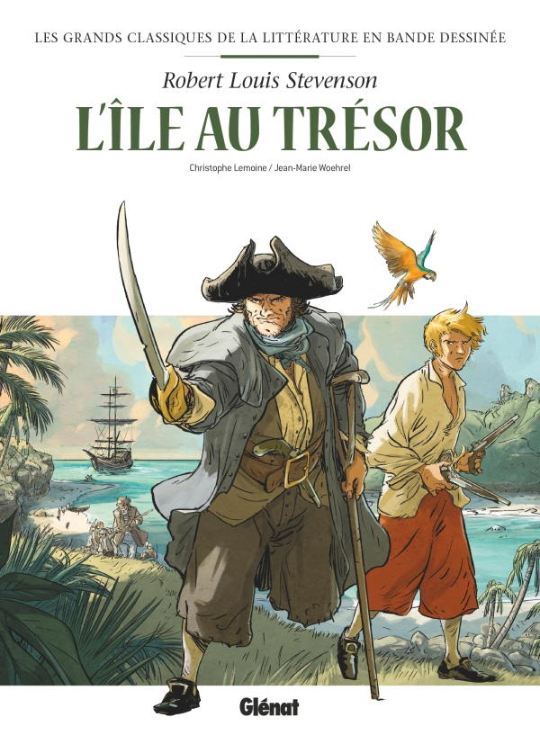

+++
title = "L'île au trésor"
image = "ileautresor"
css = "../static/stylesheet.css"
parts = [
    { num = "1", title = "Le vieux boucanier", image = "Le_vieux_boucanier"},
    { num = "2", title = "Le maitre coq", image = "Le_maitre_coq"},
    { num = "3", title = "Mon aventure à terre", image = "Mon_aventure_a_terre"},
    { num = "4", title = "Le fortin", image = "Le_fortin"},
    { num = "5", title = "Mon aventure en mer", image = "Mon_aventure_en_mer"}]
+++
# L'île au trésor

Sur ce **merveilleux** site construit via des fichiers *.md* vous trouverez un résumé des différentes parties de *L'île au trésor*.
Tout dans ce site vient de *https://education.toutcomment.com/article/l-ile-au-tresor-stevenson-resume-detaille-par-chapitre-12910.html*

